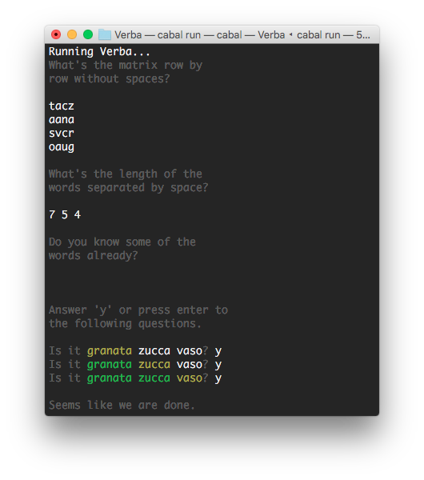

#Verba

Verba is a solver for the game WordBrain.

You can find the application on:

 - [iTunes Store](https://itunes.apple.com/us/app/wordbrain/id708600202?mt=8)
 - [Google Play](https://play.google.com/store/apps/details?id=se.maginteractive.wordbrain&hl=en)

###Installation

To install the program, run:

    cabal update
    cabal install verba

Then from anywhere you can start the program using:

    verba
